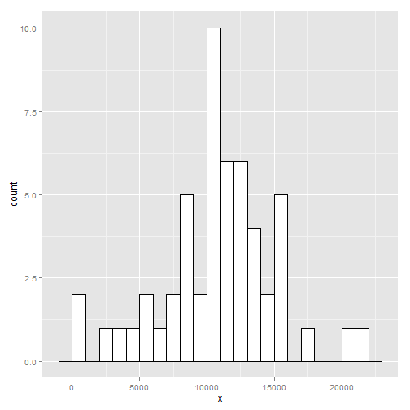
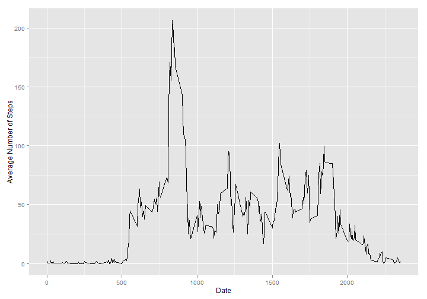
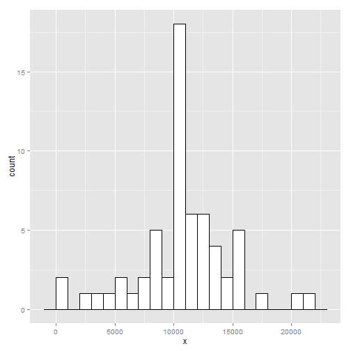
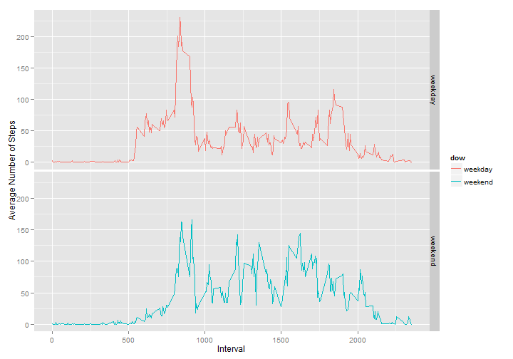

Reproducible Research - Peer Assessment 1
========================================================

This code will use data from [here](https://d396qusza40orc.cloudfront.net/repdata%2Fdata%2Factivity.zip)

## Loading and preprocessing the data


```r
# required packages
library(ggplot2)
library(plyr)

activity <- read.csv("activity.csv")

# changes dates into date classes
activity$date <- as.Date(activity$date, "%Y-%m-%d")

# removes NA values
activityclean <- na.omit(activity)
```


## What is the mean total number of steps taken per day?

### 1. Make a histogram of the total number of steps taken each day


```r
sumsteps <- aggregate(activityclean$steps, by = list(activityclean$date), FUN = sum)

ggplot(sumsteps, aes(x)) + geom_histogram(colour = "black", fill = "white", 
    binwidth = 1000)
```

 


### 2. Calculate the mean and median total number of steps taken per day


```r
# Mean
mean(sumsteps$x)
```

```
## [1] 10766
```

```r
# Median
median(sumsteps$x)
```

```
## [1] 10765
```


## What is the average daily activity pattern?

### 1. Make a time series plot (i.e. type = "l") of the 5-minute interval (x-axis) and the average number of steps taken, averaged across all days (y-axis)


```r
meansteps <- aggregate(activityclean$steps, by = list(activityclean$interval), 
    FUN = mean)

ggplot(meansteps, aes(Group.1, x)) + geom_line() + labs(x = "Date", y = "Average Number of Steps")
```

 


### 2. Which 5-minute interval, on average across all the days in the dataset, contains the maximum number of steps?


```r
maxmean <- meansteps[which.max(meansteps$x), ]
maxint <- maxmean[[1]]
colnames(maxmean) <- c("Interval", "Avg # of Steps")
maxmean
```

```
##     Interval Avg # of Steps
## 104      835          206.2
```


The 5-minute interval that contains the maximum number of steps on average is **835**.

## Imputting missing values

### 1. Calculate and report the total number of missing values in the dataset (i.e. the total number of rows with NAs)


```r
sum(is.na(activity))
```

```
## [1] 2304
```


### 2. Devise a strategy for filling in all of the missing values in the dataset.

I decided to replace each NA value with the average value for each interval of the total data set.

### 3. Create a new dataset that is equal to the original dataset but with the missing data filled in.


```r
# makes a copy of the original datea
activity1 <- activity

# merges the copy of activity and the meansteps data
# http://stackoverflow.com/questions/17129667/using-r-to-insert-a-value-for-missing-data-with-a-value-from-another-data-frame/17129885#17129885
testmerge <- merge(activity1, meansteps, by.x = "interval", by.y = "Group.1")

# reorders by date
testmerge2 <- testmerge[order(testmerge$date), ]

# figures out which rows have NA values
narow <- which(is.na(activity1$steps))

# replaces the NA rows with the rows in the merged object
activity1[narow, "steps"] = testmerge2[narow, "x"]
```


### 4. Make a histogram of the total number of steps taken each day


```r
sumstepsreplace <- aggregate(activity1$steps, by = list(activity1$date), FUN = sum)

ggplot(sumstepsreplace, aes(x)) + geom_histogram(colour = "black", fill = "white", 
    binwidth = 1000)
```

 


### 4.1 Calculate and report the mean and median total number of steps taken per day. 


```r
# Mean
mean(sumstepsreplace$x)
```

```
## [1] 10766
```

```r
# Median
median(sumstepsreplace$x)
```

```
## [1] 10766
```


### 4.2 Do these values differ from the estimates from the first part of the assignment? What is the impact of imputing missing data on the estimates of the total daily number of steps?

The mean is the same, which makes sense because I simply replaced each missing value with the average of all the other values.

The median is slightly different, because the totals for the missing days have been added, which adjusts the median slightly.

## 5. Are there differences in activity patterns between weekdays and weekends?

### Create a new factor variable in the dataset with two levels – “weekday” and “weekend” indicating whether a given date is a weekday or weekend day

```r
# creates a new column with days of the week
activity1$weekdays <- weekdays(activity1$date)

# replaces the days of the week with 'weekday' or 'weekend'
activity1$weekdays <- ifelse(activity1$weekdays %in% c("Saturday", "Sunday"), 
    "weekend", "weekday")
```


### Make a panel plot containing a time series plot (i.e. type = "l") of the 5-minute interval (x-axis) and the average number of steps taken, averaged across all weekday days or weekend days (y-axis).

```r
# subsets activity table into weekend and weekdays
activity_weekday <- activity1[activity1$weekdays == "weekday", ]
activity_weekend <- activity1[activity1$weekdays == "weekend", ]

# aggregates each table separately
agg_weekday <- aggregate(activity_weekday$steps, by = list(activity_weekday$interval), 
    FUN = mean)
agg_weekend <- aggregate(activity_weekend$steps, by = list(activity_weekend$interval), 
    FUN = mean)

# adds weekdays and weekends variable back to tables
agg_weekday$dow <- "weekday"
agg_weekend$dow <- "weekend"

# merges the tables together
agg_both <- rbind(agg_weekday, agg_weekend)


ggplot(agg_both, aes(Group.1, x)) + geom_line(aes(colour = dow)) + labs(x = "Interval", 
    y = "Average Number of Steps") + facet_grid(dow ~ .)
```

 

